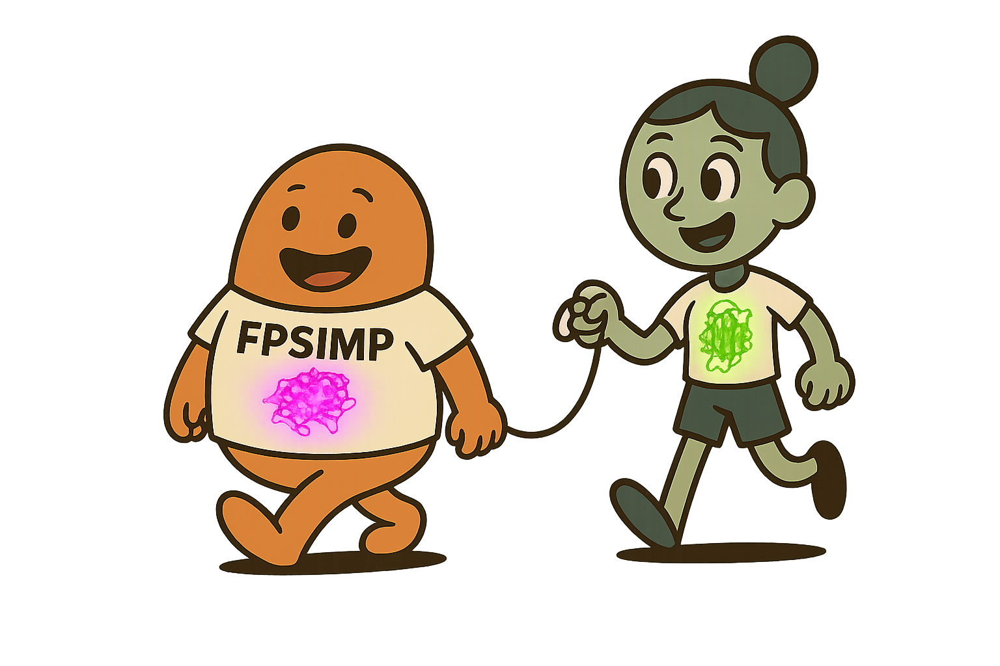
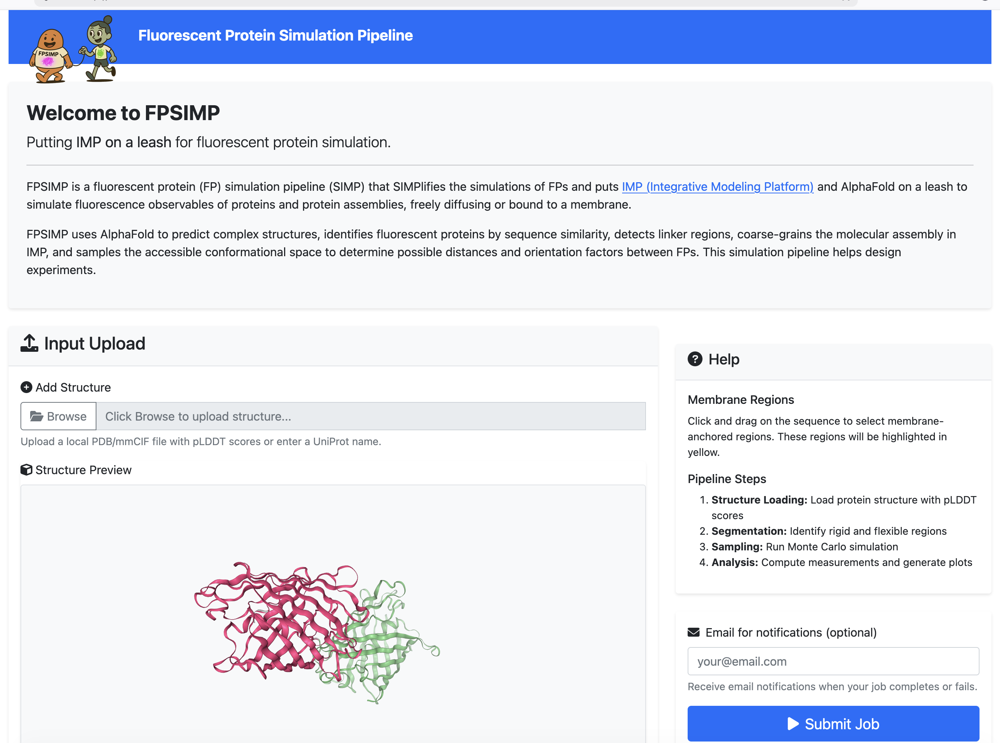

# FPSIMP: Fluorescent Protein Simulation Pipeline

<div align="center">
  
</div>

A modern, **standalone** web interface for fluorescent protein simulation that allows users to configure parameters and run simulations through a user-friendly interface. **No external dependencies required** - fully self-contained deployment.

FPSIMP is a fluorescent protein (FP) simulation pipeline (SIMP) that **SIMPlifies** the simulations of FPs and puts **[IMP (Integrative Modeling Platform)](https://integrativemodeling.org/)** and AlphaFold on a leash to simulate fluorescence observables of proteins and protein assemblies, freely diffusing or bound to a membrane.

## What It Does

FPSIMP uses AlphaFold to predict complex structures, identifies fluorescent proteins by sequence similarity, detects linker regions, coarse-grains the molecular assembly in IMP, and samples the accessible conformational space to determine possible distances and orientation factors between FPs. This simulation pipeline helps design experiments for:

- **Fluorescent protein tagging** of soluble and membrane-bound proteins
- **FRET prediction** and analysis for fluorescent protein pairs
- **Integrative modeling** of protein complexes with fluorescent tags
- **Distance and orientation measurements** between fluorescent proteins
- **Membrane-associated protein simulations** with fluorescent markers

## Features

- **AlphaFold Input**: Use AlphaFold-predicted structures as input
- **Interactive Sequence Display**: View sequences with membrane region marking
- **Comprehensive Parameter Configuration**: All CLI parameters available through web forms
- **Job Queue System**: Asynchronous job processing with Celery and Redis
- **Real-time Status Updates**: Live job status monitoring with progress indicators
- **Result Download**: Download RMF files and other simulation outputs
- **Membrane Region Marking**: Click and drag to mark membrane-anchored regions
- **Docker Deployment**: Complete containerized deployment with docker-compose
- **Standalone**: No external dependencies - fully independent

## Quick Start

### Prerequisites

- Docker and Docker Compose
- Git

### Installation

1. **Clone the repository**:
   ```bash
   git clone https://github.com/fluorescence-tools/fpsimp
   cd fpsimp
   ```

2. **Start the application**:
   ```bash
   docker-compose up -d
   ```

3. **Access the application**:
   - Web Interface: http://localhost:5000
   - Celery Monitor: http://localhost:5555

## Usage

### 1. Upload AlphaFold Structure

- Upload your AlphaFold-predicted structure file
- The sequence will be displayed for membrane region marking

### 2. Mark Membrane Regions

- Click and drag on the sequence to select membrane-anchored regions
- Selected regions will be highlighted in yellow
- Use "Clear Membrane Regions" to reset selections

### 3. Configure Parameters

The interface provides all fpsim CLI parameters organized into sections:

#### Segmentation
- **pLDDT Rigid Threshold**: Confidence threshold for rigid regions (default: 70.0)
- **Min Rigid Body Length**: Minimum length for rigid segments (default: 12)
- **Bead Size**: Residues per bead for flexible regions (default: 10)

#### Monte Carlo Sampling
- **Number of Frames**: Total simulation frames (default: 100,000)
- **Steps per Frame**: MC steps per frame (default: 10)
- **Barrier Radius**: Confinement radius (default: 100.0 Å)
- **Reuse Results**: Skip completed steps

#### Membrane Simulation
- **Enable Membrane**: Add membrane restraints
- **Membrane Weight**: Restraint strength (default: 10.0)

#### Measurements
- **Compute Measurements**: Calculate FP distances and orientations
- **Generate Plots**: Create 2D histograms and marginals

### 4. Submit Job

- Click "Submit Job" to start the pipeline
- You'll receive a unique Job ID for tracking
- The job progresses through stages: Queued → Running → Sampling Complete → Completed

### 5. Monitor Progress

- Real-time status updates with progress bar
- Status indicators for each pipeline stage
- Error reporting if jobs fail

### 6. Download Results

- Once completed, download RMF files and other outputs
- Results include topology files, segments, and simulation trajectories

### 7. Measurement Outputs

The measurement results are provided in a TSV file with the following columns:

- **frame**: Simulation frame number
- **RDA**: Distance between fluorophore centers (Å)
- **kappa**: Orientation factor $\kappa$ (if 4 sites defined)
- **kappa2**: Orientation factor $\kappa^2$ (if 4 sites defined)
- **Rapp**: Apparent distance calculated as $R_{app} = R_{DA} \times (\frac{2/3}{\kappa^2})^{1/6}$

## Pipeline Integration

The web interface includes a complete, standalone fpsim implementation:

1. **PipelineConfig**: Uses the integrated pipeline module for job execution
2. **Parameter Mapping**: All CLI parameters are supported through the web interface
3. **AlphaFold Integration**: Direct use of AlphaFold-predicted structures
4. **Membrane Regions**: Visual selection translates to membrane_seq parameters
5. **No External Dependencies**: Completely self-contained

## Web Interface

<div align="center">
  
</div>

## License

This project is licensed under the GNU General Public License v3.0. See the [LICENSE](LICENSE) file for details.